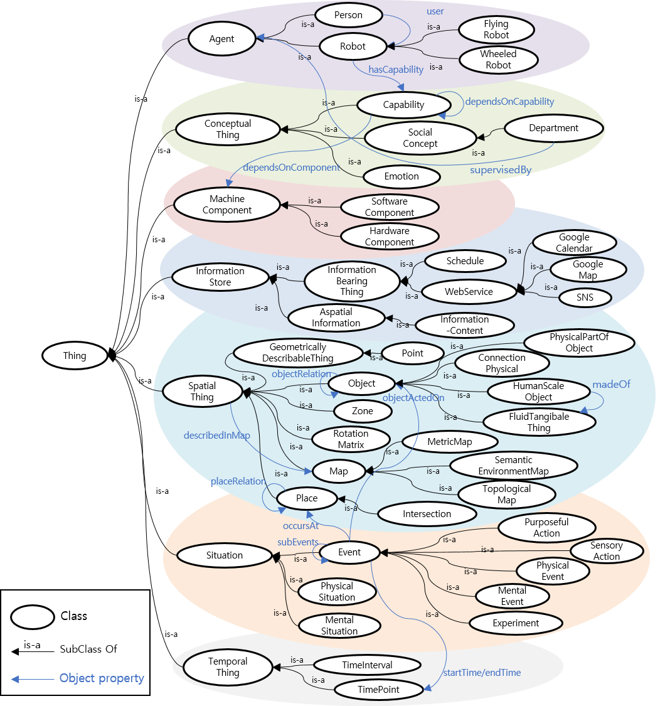

# 1. [M2-8] Social Ontology Model

## 2. package summary 

Social ontology model consists of two parts: 1) social ontology, 2) knowledge manager. Social ontology is an ontology that defines social concepts required for intelligent social service robots. Knowledge manager deals with the knowledge of social ontology. It can maintain the knowledge of social ontology consistent and can provide that knowledge to other agents if necessary.

- 2.1 Maintainer status: maintained
- 2.2 Maintainer: Gunhee Cho, [gunneng@hanyang.ac.kr]()
- 2.3 Author: Gunhee Cho, [gunneng@hanyang.ac.kr]()
- 2.4 License (optional): 
- 2.5 Source git: https://github.com/DeepTaskHY/KM

## 3. Overview

In order for a service robot to provide an intelligent social service, it is necessary to be able to plan actions suitable for the social service situation based on knowledge of the social concept. Our social ontology has been expanded by adding social concepts to the overall service robot ontology. This ontology not only includes knowledge required for general services such as user, robot profile, perception, environment, and robot behavior, but also knowledge essential in social robot services such as emotional status, goals and intentions of user speech, and social status of users.



Knowledge manager is an agent that manages the knowledge defined in social ontology and serves as an interface between other agents and social ontology. At this time, the information provided to other agents from social ontology includes not only predefined information, but also newly produced information through knowledge processing by knowledge manager.

## 4. Hardware requirements

None


## 5. Quick start

### 5.1 Environment

- **Ubuntu** 14.04
- **ROS** kinetic
- **Java Runtime Environment** 1.8 ([https://java.com/ko/download/]())

### 5.1 Configuration & run

- Start _**roscore**_
    ```
    $ roscore
    ```

- Copy the URI of ROS master from the terminal.
    ```
    ROS_MASTER_URI=http://##########/11311/
    ```

- Open _**/configuration/RosConfiguration.xml**_ file and paste the URI to the \<MasterUri\>.
    ```
    <?xml version="1.0" encoding="UTF-8"?>
    <RosConfiguration>
	    <MasterUri>http://##########:11311/</MasterUri>
    </RosConfiguration>
    ```

- Run _**Knowledge Manager**_.
    ```
    $ ./run.sh
    ```

## 6. Input/Subscribed Topics

```
{
    "header": {
        "source": "planning",
        "target": ["knowledge"],
        "content": ["social_context"],
        "timestamp": "1591935547.972"
    },
    "social_context": {
        "id": 123,
        "name": "이병현",
        "isro_social": [
            "gender": "",
            "age": "",
            "appellation": "",
            "action_sentiment": "",
            "visit_History": "",
            "medical_record": ""
        ],
        "information": {}
    }
}
```
○ /taskExecution (std_mags/String): This topic contains "header" containing the message meta information and "social_context" containing a specification of the social context to be provided.

- header
    - timestamp: published time  
    - source: publish module name  
    - target: receive module name list
    - content: role of this ROS topic name  
- social_context
    - id: context id
    - name: user name
    - isro_social: social information of the user
    - information: additional information for some special requests


## 7. Output/Published Topics

```
{
    "header" : {
        "source": "knowledge",
        "target": ["planning", "dialog"],
        "content": ["social_context"],
        "timestamp": "1591935589.122"
    },
    "social_context": {
        "id": 123,
        "name": "이병현",
        "isro_social": [
            "gender": "남성",
            "age": "노인",
            "appellation": "연구원",
            "action_sentiment": "Neutral",
            "visit_History": "",
            "medical_record": ""
        ],
        "information": {},
        "result": "completion"
    }
}
```
○ /taskCompletion (std_mags/String): This topic contains "header" containing the message meta information and "social_context" containing a specification of the social context to be provided.

- header
    - timestamp: published time  
    - source: publish module name  
    - target: receive module name list
    - content: role of this ROS topic name

- social_context
    - id: context id
    - name: user name
    - isro_social: social information of the user
    - information: additional information for some special requests
    - result: task completion result

## 8. Parameters

## 9. Related Applications (Optional)

## 10. Related Publications (Optional)

